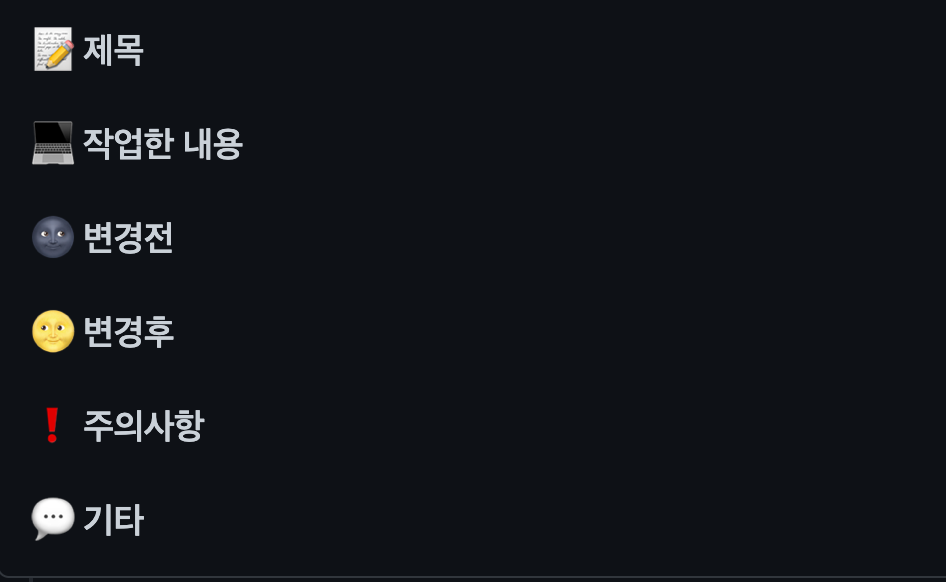

## **협업가이드**

### **Branch Naming**
#### Type
1. feature
    > feature/기능  
    > 새로운 기능 개발 시 작업하는 branch

    ```bash
    feature/login
    ```
2. error, refactor, fix
    > type/#issuenumber  
    > error : 에러이슈 발생 시 작업하는 branch  
    > refactor : 코드 리팩토링을 위한 branch  
    > fix : 기능 수정을 위한 branch
    ```bash
    error/#1
    ```

<br/>

### **Commit Message Rule**
<br/>

> branch name : Description
```bash
feature/login : 프로필 이미지와 하단 이미지 레이아웃 수정
```

### **Pull Request Rule**
> Title  
> branch name : 한문장으로 충분히 이해가 되는설명
```bash
feature/login : 로그인 카카오 인증 api - api 연동
error/#issuenumber : 카카오 로그인 인증 서비스 오류 발생
```
<p align="center">

</p>
    
### **Code Convention**
>https://naver.github.io/hackday-conventions-java/
  
<br/>  

### **Label**

> github-label-sync 설치
 ```bash
 npm install -g github-label-sync
 ```


> label 적용
```bash
github-label-sync --access-token [token] --labels labels.json [organization]/[reponame]
```

